# CollabCanvas

> **Real-time Collaborative Design Platform**

A high-performance, multiplayer canvas application that enables teams to create and manipulate shapes collaboratively with live cursor tracking, smart conflict resolution, and seamless real-time synchronization.

[](https://collab-canvas02.vercel.app/)
[](docs/)


## ✨ Features

### 🎨 **Real-Time Collaboration**
- **Live Cursors**: See teammates' cursors with names and colors in real-time
- **Instant Sync**: Shape creation and modifications appear instantly across all users
- **Presence Awareness**: Know who's online and actively collaborating

### 🔒 **Smart Conflict Resolution**
- **First-Click Locking**: Elegant conflict prevention with visual feedback
- **Optimistic Updates**: Responsive interactions with background synchronization
- **Automatic Cleanup**: Locks release automatically on disconnect or completion

### ⚡ **High Performance**
- **60 FPS Rendering**: Smooth interactions powered by Konva.js
- **<50ms Cursor Latency**: Real-time cursor updates at 20-30 FPS
- **Scalable Architecture**: Supports 500+ shapes with 5+ concurrent users

### 🎯 **Intuitive Design**
- **Click-and-Drag Creation**: Create rectangles with live preview
- **Pan & Zoom**: Navigate a large 5000×5000px canvas
- **Color Selection**: Professional toolbar with instant feedback

## 🚀 Quick Start

### Prerequisites
- Node.js 18+ and npm 9+
- Java 11+ (for Firebase Emulators)

### Local Development
```bash
# 1. Clone and install dependencies
git clone https://github.com/niftyclaudia/collab-canvas02
cd collab-canvas02/app
npm install

# 2. Start Firebase Emulators (Terminal 1)
npm run emulate

# 3. Start Development Server (Terminal 2)
npm run dev

# 4. Open http://localhost:5173 in multiple browsers to test collaboration
```

**🎮 Test Collaboration**: Open the app in multiple browser windows, sign up as different users, and watch real-time cursors and shape creation in action!

## 🏗️ Architecture

CollabCanvas uses a hybrid Firebase architecture optimized for real-time collaboration:

```mermaid
graph TB
    Users([👥 Multiple Users]) --> UI[React + TypeScript UI]
    UI --> Services[Service Layer]
    Services --> RTDB[(Realtime DB<br/>Cursors & Presence)]
    Services --> Firestore[(Firestore<br/>Shapes & Users)]
    Services --> Auth[Firebase Auth]
    UI --> Konva[Konva.js Canvas]
```



### Key Design Decisions
- **Hybrid Database**: RTDB for ephemeral data (cursors), Firestore for persistent data (shapes)
- **Service Layer Pattern**: Clean separation between UI and Firebase operations
- **Individual Documents**: Shapes stored as separate Firestore documents for scalability
- **Optimistic Locking**: Visual feedback with background conflict resolution

## 🛠️ Tech Stack

| Layer | Technology | Purpose |
|-------|------------|---------|
| **Frontend** | React 19 + TypeScript + Vite | Modern, type-safe UI development |
| **Canvas** | Konva.js + react-konva | High-performance 2D canvas rendering |
| **Real-time** | Firebase Realtime Database | <50ms cursor and presence updates |
| **Persistence** | Firebase Firestore | Structured shape and user data |
| **Authentication** | Firebase Auth | Secure user management |
| **Deployment** | Vercel | Fast, global CDN deployment |

## 📖 Documentation

Our documentation is comprehensive and well-organized. Start with these key documents:

### 🎯 **New to the Project?**
- [📋 Setup Guide](docs/guides/setup-guide.md) - Complete development setup
- [🏗️ Architecture Overview](docs/project/architecture.md) - System design and patterns
- [🚀 Quick Start Guide](docs/development/PR-1-QUICK-START.md) - 30-second collaboration test

### 📊 **Understanding the Product**
- [📋 Product Requirements](docs/project/prd.md) - Features, user stories, and requirements
- [📈 Development Process](docs/development/dev-log.md) - AI-assisted development workflow
- [✅ Implementation Status](docs/development/) - Feature completion tracking

### 🔧 **For Developers**
- [📁 Full Documentation Index](docs/) - Navigate all available docs
- [🧪 Test Plans](docs/development/PR-1-TEST-PLAN.md) - Comprehensive testing scenarios
- [📋 Task Breakdown](docs/project/tasks.md) - Detailed development phases

## 🎯 Use Cases

### **Design Teams**
- Collaborative wireframing and mockups
- Real-time design reviews and feedback
- Brainstorming sessions with visual elements

### **Education**
- Interactive geometry lessons
- Collaborative problem-solving exercises
- Group projects with live participation

### **Development**
- System architecture diagramming
- User flow collaborative design
- Technical specification visualization

## 🚧 Roadmap

CollabCanvas is actively developed with these planned enhancements:

### **Phase 2** (Next Release)
- [ ] **Shape Variety**: Circles, lines, and text elements
- [ ] **Advanced Editing**: Resize handles and rotation controls
- [ ] **Enhanced UX**: Delete functionality and multi-select

### **Phase 3** (Future)
- [ ] **AI Integration**: Smart shape suggestions and layout assistance
- [ ] **Mobile Support**: Touch-optimized collaborative experience
- [ ] **Advanced Features**: Layers, grouping, and export functionality

## 🤝 Contributing

We welcome contributions! Here's how to get started:

1. **Fork the repository** and create a feature branch
2. **Follow our documentation standards** - see [docs/](docs/) for examples
3. **Test thoroughly** - use our [test plans](docs/development/PR-1-TEST-PLAN.md)
4. **Submit a pull request** with clear description

### Development Workflow
- All development uses Firebase Emulators (no costs)
- Follow our [Architecture Guide](docs/project/architecture.md) for patterns
- Reference [Task Breakdown](docs/project/tasks.md) for implementation approach

### 🚀 Quick PR Creation
Use our automated PR script for streamlined pull request creation:

```bash
# Create a feature branch and make your commits
git checkout -b feature/my-awesome-feature
git commit -m "Add amazing feature"

# Create PR with automatic summary
./pr develop
```

The script automatically:
- ✅ Collects all commits and changes
- 📝 Generates comprehensive PR description
- 🔗 Creates PR and returns the link
- 🌐 Optionally opens PR in browser

**[Full PR Workflow Guide →](docs/guides/pr-workflow.md)**

## 📊 Performance

CollabCanvas is built for performance and scale:

- **Rendering**: Maintains 60 FPS with 500+ shapes
- **Collaboration**: <100ms shape synchronization latency
- **Cursors**: 20-30 FPS updates with <50ms latency
- **Concurrent Users**: Tested with 5+ simultaneous collaborators
- **Canvas Size**: 5000×5000px workspace with smooth pan/zoom

## 📄 License

This project is licensed under the MIT License - see the [LICENSE](LICENSE) file for details.

## 🙏 Acknowledgments

- Built with modern React and Firebase best practices
- Inspired by collaborative design tools like Figma and Miro
- Developed using AI-assisted development techniques with Claude and Cursor

---

**🎨 Ready to collaborate?** [Try CollabCanvas Live](https://collab-canvas02.vercel.app/) or [Browse Documentation](docs/)

*Built with ❤️ for real-time collaboration*