# CollabCanvas Architecture Document

## Overview

CollabCanvas is a **production-ready collaborative design tool with AI assistance**, built for professional multi-user design workflows with real-time synchronization. The architecture delivers advanced Figma-inspired features (multi-select, grouping, alignment, z-index management) alongside natural language AI control, all powered by a robust multiplayer infrastructure.

**Development Phases:**
- **Phase 1 (MVP - 24 hours):** Core real-time collaboration foundation
- **Phase 2 (Production - 72 hours):** Advanced features + AI integration ⭐ CURRENT

This document reflects the **Phase 2 architecture** with all production-ready capabilities.

## Architecture Diagram

```mermaid
graph TB
    User([👥 Users - Multiple Browsers])
    
    subgraph Client["Client Layer - React + TypeScript"]
        subgraph UI["UI Components"]
            Auth[🔐 Auth<br/>Login/Signup]
            Canvas[🎨 Canvas<br/>5000×5000px<br/>Pan/Zoom/Draw<br/>Resize/Rotate/Text]
            Collab[👥 Collaboration<br/>Cursors/Presence]
            AIChat[🤖 AI Chat<br/>Bottom Drawer<br/>15 Tools]
            Controls[🎛️ Controls<br/>Alignment Toolbar<br/>Format Panel<br/>Z-Index Buttons]
        end
        
        subgraph State["State Management"]
            Contexts[AuthContext<br/>CanvasContext<br/>AIContext]
            Hooks[useAuth, useCanvas<br/>useCursors, usePresence<br/>useAI, useToast]
        end
        
        subgraph Services["Service Layer"]
            AuthSvc[AuthService]
            CanvasSvc[CanvasService<br/>CRUD + Locking<br/>Resize/Rotate<br/>Group/Align/Z-Index<br/>Comments]
            CursorSvc[CursorService<br/>20-30 FPS]
            PresenceSvc[PresenceService]
            AISvc[AIService ⭐<br/>15 Function Tools<br/>Layout Commands<br/>Context Awareness]
        end
    end
    
    subgraph External["External APIs"]
        OpenAI[🤖 OpenAI<br/>GPT-4-turbo<br/>Function Calling]
    end
    
    subgraph Firebase["Firebase Backend"]
        FireAuth[🔐 Firebase Auth]
        
        subgraph Firestore["Firestore - Persistent"]
            Users[(users)]
            Shapes[(shapes<br/>4 types: rect/circle/<br/>triangle/text<br/>rotation, zIndex,<br/>groupId fields)]
            Groups[(groups<br/>NEW Phase 2)]
            Comments[(comments<br/>NEW Phase 2)]
        end
        
        subgraph RTDB["RTDB - Ephemeral <50ms"]
            Cursors[(cursors<br/>30 FPS)]
            Presence[(presence<br/>auto-cleanup)]
        end
    end
    
    subgraph Rendering["Konva.js Rendering"]
        Konva[Stage + Layer<br/>60 FPS Target<br/>8 Resize Handles<br/>Rotation Handle<br/>Comment Indicators]
    end
    
    subgraph DevTools["Development"]
        Emulators[Firebase Emulators<br/>Auth:9099, Firestore:8080<br/>RTDB:9000]
        Tests[Vitest + RTL<br/>Unit + Integration]
    end
    
    subgraph Deploy["Production"]
        Vercel[☁️ Vercel Hosting]
        ProdFB[Production Firebase]
    end

    %% Main Flow
    User --> UI
    UI --> State
    State --> Services
    
    %% Firebase Connections
    AuthSvc --> FireAuth
    AuthSvc --> Users
    CanvasSvc --> Shapes
    CanvasSvc --> Groups
    CanvasSvc --> Comments
    CursorSvc --> Cursors
    PresenceSvc --> Presence
    
    %% AI Connections
    AISvc --> OpenAI
    AISvc --> CanvasSvc
    AIChat --> AISvc
    
    %% Rendering
    Canvas --> Konva
    Controls --> Konva
    CanvasSvc -.sync.-> Konva
    CursorSvc -.sync.-> Konva
    
    %% Dev/Deploy
    Services -.dev.-> Emulators
    Services -.prod.-> ProdFB
    Tests --> Emulators
    UI -.build.-> Vercel
    
    %% Styling
    classDef client fill:#e1f5ff,stroke:#0066cc,stroke-width:2px
    classDef firebase fill:#fff3e0,stroke:#f57c00,stroke-width:2px
    classDef render fill:#f3e5f5,stroke:#7b1fa2,stroke-width:2px
    classDef dev fill:#fce4ec,stroke:#c2185b,stroke-width:2px
    classDef user fill:#ffebee,stroke:#d32f2f,stroke-width:3px
    classDef ai fill:#e8f5e9,stroke:#2e7d32,stroke-width:2px
    
    class Client,UI,State,Services client
    class Firebase,FireAuth,Firestore,RTDB,Users,Shapes,Groups,Comments,Cursors,Presence firebase
    class Rendering,Konva render
    class DevTools,Emulators,Tests,Deploy,Vercel,ProdFB dev
    class User user
    class External,OpenAI,AISvc,AIChat ai
```



## Technical Stack

### Frontend
- **Framework**: React 18 with TypeScript and Vite
- **Canvas Rendering**: Konva.js with react-konva (60 FPS target)
- **State Management**: React Context with custom hooks pattern
- **UI Libraries**: React Hot Toast (notifications)
- **Utilities**: Lodash (throttle/debounce for performance optimization)
- **Styling**: CSS with responsive design

### Backend & Synchronization
- **Firebase Authentication**: Email/password authentication
- **Firebase Firestore**: Persistent data (shapes, user profiles, locks, groups, comments)
- **Firebase Realtime Database**: High-frequency ephemeral data (cursors, presence)
- **Firebase Security Rules**: Production-ready access control

### AI Integration ⭐ NEW Phase 2
- **OpenAI SDK**: GPT-4-turbo with function calling
- **Tools**: 15 function tools for canvas manipulation
- **Features**: Natural language commands, context awareness, layout operations

### Development & Deployment
- **Testing**: Vitest + React Testing Library + Firebase Emulators
- **Deployment**: Vercel (frontend hosting)
- **Development Environment**: Firebase Emulators Suite
- **API Keys**: Environment variable management (.env)

## Architecture Patterns

### Service Layer Pattern
The architecture follows a clean service layer pattern for separation of concerns:

```
UI Components (Canvas, AIChat, Controls, Collaboration)
     ↓
React Context (AuthContext, CanvasContext, ToastContext)
     ↓
Custom Hooks (useAuth, useCanvas, useCursors, usePresence, useToast)
     ↓
Service Layer (AuthService, CanvasService, CursorService, PresenceService, AIService)
     ↓
External APIs (Firebase Auth, Firestore, RTDB, OpenAI API)
```

**Benefits:**
- Clean separation of concerns
- Testable with Firebase Emulators
- Easier to extend with additional features
- Consistent API for all interactions
- Mockable for unit testing
- AI service leverages same CanvasService methods (no duplication)

### Hybrid Database Strategy

**Why Two Firebase Databases?**

1. **Firestore (Persistent Data)**:
   - User profiles and settings
   - Shape data with locks
   - Structured queries and indexing
   - ACID transactions for critical operations

2. **Realtime Database (Ephemeral Data)**:
   - Cursor positions (20-30 FPS updates)
   - User presence status
   - <50ms latency vs Firestore's ~200ms
   - Built-in `onDisconnect()` for automatic cleanup
   - Lower costs for high-frequency updates

## Data Models

### Firestore Collections

#### users Collection
```typescript
interface User {
  uid: string;
  username: string;
  email: string;
  cursorColor: string; // Hex color assigned at signup
  createdAt: Timestamp;
}
```

#### canvases/main/shapes Collection (Individual Documents)
```typescript
interface Shape {
  id: string;
  type: 'rectangle' | 'circle' | 'triangle' | 'text'; // NEW: 4 shape types
  
  // Position & Transform
  x: number;
  y: number;
  rotation: number; // NEW: 0-360 degrees
  
  // Rectangle & Triangle specific
  width?: number;
  height?: number;
  color: string; // Fill color (#3b82f6, #ef4444, #10b981, #f59e0b, etc.)
  
  // Circle specific
  radius?: number; // NEW: For circle shapes
  
  // Text specific
  text?: string; // NEW: Text content
  fontSize?: number; // NEW: 12-48px
  fontWeight?: 'normal' | 'bold'; // NEW: Text formatting
  fontStyle?: 'normal' | 'italic'; // NEW: Text formatting
  textDecoration?: 'none' | 'underline'; // NEW: Text formatting
  
  // Advanced features
  zIndex: number; // NEW: Stacking order (higher = on top)
  groupId: string | null; // NEW: Reference to group (if grouped)
  
  // Metadata
  createdBy: string; // User ID
  createdAt: Timestamp;
  lockedBy: string | null;
  lockedAt: Timestamp | null;
  updatedAt: Timestamp;
}
```

**Individual Documents Rationale:**
- Scales to 500+ objects without performance degradation
- No 1MB document size limit concerns
- Superior concurrent editing (eliminates array update conflicts)
- Better query performance for shape-specific operations
- Flexible schema supports multiple shape types with optional fields

#### canvases/main/groups Collection (NEW Phase 2)
```typescript
interface Group {
  id: string;
  name: string; // Optional user-defined or auto-generated
  shapeIds: string[]; // Array of shape IDs in this group
  createdBy: string; // User ID
  createdAt: Timestamp;
}
```

**Purpose:** Groups multiple shapes to move together as one unit. When any shape in a group is selected, the entire group is selected.

#### canvases/main/comments Collection (NEW Phase 2)
```typescript
interface Comment {
  id: string;
  shapeId: string; // Shape this comment is attached to
  userId: string;
  username: string;
  text: string; // Comment content
  x?: number; // Optional pin position on canvas
  y?: number;
  createdAt: Timestamp;
  resolved: boolean; // Can be marked as resolved
  replies: Reply[]; // Nested replies
}

interface Reply {
  userId: string;
  username: string;
  text: string;
  createdAt: Timestamp;
}
```

**Purpose:** Collaborative commenting system for shape feedback and team communication.

### RTDB Structure

#### /sessions/main/users/{userId} Path
```typescript
interface RTDBUser {
  cursor: {
    x: number;
    y: number;
    username: string;
    color: string;
    timestamp: number;
  };
  presence: {
    online: boolean;
    lastSeen: number;
    username: string;
  };
}
```

## Core Systems

### 1. Authentication System
**Design**: Simplified email/password authentication (Google OAuth removed for time savings)

**Flow**:
1. User signs up with email/password/username
2. AuthService creates Firebase Auth user + Firestore user document
3. Random cursor color assigned from predefined palette
4. Session persists across browser refreshes
5. Username and logout controls displayed in header

### 2. Real-Time Cursor Synchronization
**Target Performance**: 20-30 FPS (33-50ms update intervals)

**Implementation**:
1. Mouse position tracked over canvas
2. Coordinates throttled using lodash (33ms intervals)
3. Converted from screen to canvas coordinates
4. Written to RTDB: `/sessions/main/users/{userId}/cursor`
5. All users subscribe to cursor updates
6. Remote cursors rendered with username labels

**Why RTDB**: <50ms latency vs Firestore's ~200ms for cursor-smooth experience

### 3. Presence System
**Automatic Cleanup**: Leverages RTDB `onDisconnect()` for immediate status updates

**Flow**:
1. User marked online on authentication
2. Presence written to RTDB with disconnect handler
3. Online users list updates in real-time
4. Automatic cleanup when browser closes/network drops
5. Visual indicators with cursor color matching

### 4. Canvas System
**Canvas Specifications**: 5000×5000px workspace with Konva.js rendering

**Features**:
- Click-and-drag panning (or spacebar + drag)
- Mouse wheel zoom (cursor-centered)
- Zoom range: 0.1x to 3.0x
- 60 FPS target performance
- Two-color toolbar: Muted Sky Blue (#67a3c1), Green (#10b981)

### 5. Shape Creation & Real-Time Preview ⭐ SHOWCASE FEATURE
**The Innovation**: All users see light green outline during shape creation

**Click-and-Drag Flow**:
1. User clicks canvas background (mousedown)
2. Drag tracking begins with start coordinates
3. **Real-time preview**: Rectangle with light green outline broadcasts to all users
4. Dynamic dimensions update during drag
5. MouseUp finalizes shape if ≥10×10px
6. Final shape sync via Firestore to all users

**Edge Cases Handled**:
- Negative drags (leftward/upward)
- Minimum size enforcement
- Distinction from canvas panning

### 6. Simple Shape Locking (Simplified for MVP)
**Strategy**: First-click wins with visual feedback only

**Lock Acquisition**:
1. User clicks shape
2. CanvasService attempts Firestore lock: `lockedBy: userId, lockedAt: timestamp`
3. Success: Light green outline displayed, dragging enabled
4. Failure: Shape already locked, interaction prevented

**Lock Release**:
- Click away (deselect shape)
- Drag completion (onDragEnd)
- User disconnect (via presence cleanup)

**Simplifications for MVP Timeline**:
- ❌ No auto-timeout logic (saves 30 min implementation)
- ❌ No cursor state changes (saves 15 min development)
- ✅ Visual feedback only (light green outline)

### 7. Resize System ⭐ NEW Phase 2
**8-Handle Resize Interface**: Professional transform controls for all shape types

**Handle Configuration**:
- **8 handles** appear when shape is locked by current user
- **Corner handles (4)**: TL, TR, BL, BR - proportional resize (maintains aspect ratio)
- **Edge handles (4)**: T, B, L, R - single dimension resize
- **Visual design**: 8×8px white squares with gray border
- **Hover state**: Scales to 10×10px, changes to blue
- **Active drag**: Shows dimension tooltip "200 × 150" above shape

**Implementation Details**:
- Minimum size enforcement: 10×10px for rectangles/triangles, 5px radius for circles
- Real-time dimension calculations during drag
- Error toast if minimum size violated
- CanvasService method: `resizeShape(shapeId, width, height)`
- Syncs to Firestore with `updatedAt` timestamp

**Performance**: Smooth 60 FPS during resize operations

### 8. Rotation System ⭐ NEW Phase 2
**Single-Handle Rotation Interface**: Intuitive rotation around shape center

**Rotation Handle**:
- **Position**: 30px above shape center when locked
- **Visual**: 12px diameter circle with "↻" rotation icon
- **Connecting line**: Thin gray line from shape to handle (visual guide)
- **Cursor**: Changes to rotation cursor on hover

**Implementation Details**:
- Calculates angle from shape center to cursor position during drag
- Shows angle tooltip during drag: "45°"
- Rotation normalized to 0-360° range
- All shape types rotate around their center point
- Konva offset properties for center-point rotation
- CanvasService method: `rotateShape(shapeId, rotation)`

**Edge Cases**:
- Rotation beyond 360° normalizes correctly (e.g., 405° → 45°)
- Negative angles convert to positive (e.g., -45° → 315°)
- Dragging and resize handles work correctly with rotated shapes

### 9. Text Layer System ⭐ NEW Phase 2
**Professional Text Tools**: Full typography control with formatting

**Text Creation**:
1. Click "Text" button in toolbar → activates text placement mode
2. Click on canvas → input field appears at clicked position
3. Type text, press Enter → creates text layer
4. Escape cancels creation

**Text Editing**:
- Double-click existing text → enters edit mode
- Shows editable input field in same position
- Enter saves, Escape cancels

**Text Formatting**:
- **Bold [B]**: Toggle font weight (normal ↔ bold)
- **Italic [I]**: Toggle font style (normal ↔ italic)
- **Underline [U̲]**: Toggle text decoration (none ↔ underline)
- **Font Size**: Dropdown with sizes 12, 14, 16, 18, 20, 24, 32, 48px
- Multiple formats can be active simultaneously

**Format Controls Panel**:
```
┌──────────────────────────────────┐
│ Text                             │
├──────────────────────────────────┤
│ [🗑️ Delete]  [📋 Duplicate]     │
├──────────────────────────────────┤
│ [B] [I] [U̲] | Font: [16px ▼]   │
└──────────────────────────────────┘
```

**Implementation**:
- CanvasService methods: `createText()`, `updateText()`, `updateTextFontSize()`, `updateTextFormatting()`
- Konva `<Text>` component with fontStyle and textDecoration props
- Text layers support rotation, dragging, locking like other shapes
- Default: 16px, black (#000000)

### 10. Multi-Select System ⭐ NEW Phase 2
**Professional Selection Tools**: Select and manipulate multiple shapes simultaneously

**Selection Methods**:

**1. Shift+Click Selection**:
- Click shape while holding Shift → adds to selection
- Shift+click again → removes from selection
- Visual: All selected shapes show blue border (3px)
- Click background (no Shift) → clears selection

**2. Marquee Selection**:
- Click and drag on canvas background → shows selection rectangle
- Visual: Dashed blue border, semi-transparent blue fill (20% opacity)
- On release: selects all shapes whose bounding boxes intersect marquee
- With Shift held: adds to current selection
- Without Shift: replaces selection

**Multi-Shape Operations**:
- **Move**: Drag any selected shape → all move together (maintain relative positions)
- **Delete**: Deletes all selected shapes
- **Duplicate**: Duplicates all with 20px offset
- **Group**: Group button appears in controls panel
- **Align**: Alignment tools appear in controls panel

**State Management**:
```typescript
const [selectedShapes, setSelectedShapes] = useState<string[]>([]);
```

**Performance**: Marquee intersection calculation throttled to 60 FPS

### 11. Object Grouping System ⭐ NEW Phase 2
**Tier 1 Feature**: Group multiple shapes into single moveable unit

**Grouping Flow**:
1. Select 2+ shapes (multi-select)
2. "Group" button appears in controls panel
3. Click Group → creates group document in Firestore
4. All shapes updated with `groupId` field (batch write)
5. Grouped shapes show shared dashed border when selected

**Group Behavior**:
- Click any shape in group → selects entire group
- Drag any member → entire group moves together
- Delete group → deletes all member shapes
- Duplicate group → duplicates all members with shared offset
- Lock applies to all group members

**Ungrouping**:
- Select grouped shapes → "Ungroup" button appears
- Click Ungroup → removes `groupId` from all shapes (batch write)
- Shapes become individually selectable again

**Data Structure**:
- Groups stored in `canvases/main/groups` collection
- Shapes reference group via `groupId` field
- Real-time subscription keeps group membership synchronized

**CanvasService Methods**:
- `groupShapes(shapeIds, userId, name?)` → creates group
- `ungroupShapes(groupId)` → dissolves group

### 12. Z-Index Management System ⭐ NEW Phase 2
**Tier 2 Feature**: Layer stacking control for overlapping shapes

**Z-Index Operations**:
- **To Front**: Sets shape's zIndex to max + 1
- **To Back**: Sets shape's zIndex to min - 1
- **Forward**: Increments zIndex by 1
- **Backward**: Decrements zIndex by 1

**UI Controls**:
```
[⬆️🔝 To Front]   [⬆️ Forward]
[⬇️⬇️ To Back]    [⬇️ Backward]
```

**Keyboard Shortcuts**:
- Cmd/Ctrl+Shift+] : To Front
- Cmd/Ctrl+Shift+[ : To Back
- Cmd/Ctrl+] : Forward
- Cmd/Ctrl+[ : Backward

**Rendering**:
```typescript
const sortedShapes = shapes.sort((a, b) => (a.zIndex || 0) - (b.zIndex || 0));
// Render shapes in sorted order (lower zIndex first, higher on top)
```

**Implementation**:
- Each shape has `zIndex: number` field
- CanvasService methods: `bringToFront()`, `sendToBack()`, `bringForward()`, `sendBackward()`
- Real-time sync ensures all users see correct layering

### 13. Alignment Tools System ⭐ NEW Phase 2
**Tier 2 Feature**: Precise positioning for professional layouts

**Alignment Toolbar** (appears when 2+ shapes selected):

**Row 1 - Alignment (6 types)**:
- **Left**: Align all shapes to leftmost x position
- **Center**: Align to average horizontal center
- **Right**: Align to rightmost x + width
- **Top**: Align to topmost y position
- **Middle**: Align to average vertical center
- **Bottom**: Align to bottommost y + height

**Row 2 - Distribution (2 types)**:
- **Horizontal**: Space shapes evenly left to right
- **Vertical**: Space shapes evenly top to bottom

**Implementation**:
```typescript
async alignShapes(
  shapeIds: string[], 
  alignment: 'left' | 'center' | 'right' | 'top' | 'middle' | 'bottom'
): Promise<void>

async distributeShapes(
  shapeIds: string[], 
  direction: 'horizontal' | 'vertical'
): Promise<void>
```

**Algorithm**:
1. Fetch all selected shape data
2. Calculate target position (min, max, or average)
3. Update shape positions with Firestore batch write
4. Real-time sync to all users

**Use Cases**:
- Create clean aligned layouts
- Evenly space UI elements
- Align form fields
- Organize grids and lists

### 14. Keyboard Shortcuts System ⭐ NEW Phase 2
**Tier 1 Feature**: 15+ shortcuts for power users

**Shape Operations**:
- `Delete/Backspace`: Delete selected shapes
- `Cmd/Ctrl+D`: Duplicate
- `Cmd/Ctrl+C`: Copy to clipboard
- `Cmd/Ctrl+V`: Paste from clipboard
- `Cmd/Ctrl+G`: Group shapes
- `Cmd/Ctrl+Shift+G`: Ungroup

**Movement**:
- `Arrow Keys`: Nudge 10px in direction
- `Shift+Arrow`: Fine nudge 1px

**Z-Index**:
- `Cmd/Ctrl+]`: Bring forward
- `Cmd/Ctrl+[`: Send backward
- `Cmd/Ctrl+Shift+]`: Bring to front
- `Cmd/Ctrl+Shift+[`: Send to back

**Selection**:
- `Cmd/Ctrl+A`: Select all shapes
- `Escape`: Clear selection

**Canvas**:
- `Cmd/Ctrl+0`: Reset zoom to 100%

**Implementation**:
- Global keydown event listener in Canvas component
- Excludes keyboard events when typing in input fields
- Platform detection (Mac metaKey vs Windows/Linux ctrlKey)
- Visual toast feedback for each action

### 15. Copy/Paste System ⭐ NEW Phase 2
**Tier 1 Feature**: Clipboard operations for quick duplication

**Workflow**:
1. Select shapes → Press Cmd/Ctrl+C
2. Toast: "Copied X shapes"
3. Press Cmd/Ctrl+V
4. Duplicates appear with 20px offset
5. Toast: "Pasted X shapes"
6. Pasted shapes auto-selected

**State Management**:
```typescript
const [clipboard, setClipboard] = useState<Shape[] | null>(null);
```

**Implementation**:
- Copy stores selected shapes in local state (not Firebase)
- Paste calls `duplicateShape()` for each clipboard shape
- Clipboard persists during session (lost on refresh - acceptable for MVP)
- Works with individual shapes and groups

### 16. Collaborative Comments System ⭐ NEW Phase 2
**Tier 3 Feature**: Team communication on canvas elements

**Comment Indicators**:
- Shapes with comments show comment icon (💬) in top-right corner
- Badge shows count: "💬 3"
- Icon pulses when new comment added

**Comment Panel** (300px wide, floating near shape):
```
┌─────────────────────────────────────┐
│ Comments (3)              [×]       │
├─────────────────────────────────────┤
│ Alice • 2 min ago                   │
│ This needs to be bigger             │
│   Bob • 1 min ago                   │
│   I agree, let's make it 300px      │
│ [Reply...]                          │
│ [✓ Resolve]                         │
├─────────────────────────────────────┤
│ [Add comment...]                    │
└─────────────────────────────────────┘
```

**Features**:
- Threaded replies (nested conversations)
- Resolve/unresolve comments
- Real-time updates (new comments appear instantly)
- Username and timestamp for each comment
- "Show resolved" toggle

**Implementation**:
- Comments stored in `canvases/main/comments` collection
- Real-time subscription via Firestore `onSnapshot()`
- CanvasService methods: `addComment()`, `resolveComment()`, `addReply()`, `deleteComment()`
- Rendered as Konva elements on canvas layer

### 17. AI Canvas Agent System ⭐ NEW Phase 2 (CRITICAL)
**Worth 25 Points**: Natural language interface to all canvas features

**AI Architecture**:
```
User Natural Language Command
     ↓
AI Chat Interface (Bottom Drawer)
     ↓
AIService.executeCommand(prompt, userId)
     ↓
OpenAI GPT-4-turbo with Function Calling
     ↓
15 Tool Definitions (creation, manipulation, layout, grouping, alignment, z-index, comments)
     ↓
Tool Execution Router
     ↓
CanvasService Methods (same methods as manual UI)
     ↓
Firestore Updates
     ↓
Real-time Sync to All Users
```

**15 Function Tools**:

**Creation (4 tools)**:
1. `createRectangle` - Create rectangle with position, size, color
2. `createCircle` - Create circle with center, radius, color
3. `createTriangle` - Create triangle with bounding box, color
4. `createText` - Create text with position, fontSize, color, formatting

**Manipulation (5 tools)**:
5. `moveShape` - Move shape to new position
6. `resizeShape` - Change dimensions
7. `rotateShape` - Rotate by degrees
8. `duplicateShape` - Create copy
9. `deleteShape` - Remove shape

**Grouping (1 tool)**:
10. `groupShapes` - Group multiple shapes

**Alignment (2 tools)**:
11. `alignShapes` - Align shapes (left, center, right, top, middle, bottom)
12. `arrangeShapesInRow` - **CRITICAL**: Layout command for rubric points

**Z-Index (1 tool)**:
13. `bringToFront` - Layer management

**Comments (1 tool)**:
14. `addComment` - Add comment to shape

**Canvas State (1 tool)**:
15. `getCanvasState` - Fetch all shapes (MUST call first for manipulation)

**System Prompt Engineering**:
- Canvas coordinate system (0,0 = top-left, 5000×5000)
- Position helpers (center → 2500, 2500)
- Color codes (blue → #3b82f6)
- Shape identification ("the blue rectangle")
- Multi-step operation examples (login form, grid)
- Layout command examples (**CRITICAL for rubric**)

**AI Chat Interface**:
- Bottom drawer design (slides up from bottom)
- Initial height: 300px, collapsed: 50px
- Scrollable message history
- User messages: right-aligned, blue
- AI messages: left-aligned, gray
- Success/error indicators with icons
- "⚡ AI is thinking..." loading state

**Context Awareness**:
- AI receives current canvas state (first 20 shapes) in system prompt
- Can identify shapes by color, type, position
- Handles vague references ("that rectangle", "these shapes")
- Picks most recent shape if multiple matches

**Complex Commands**:
```
"Create a login form" → 6 elements (labels, inputs, button)
"Make a 3x3 grid of red squares" → 9 positioned rectangles
"Arrange these shapes in a horizontal row" → layout command
"Group the blue shapes" → identifies and groups all blue shapes
"Align these to the left" → alignment operation
```

**Performance Targets**:
- Single-step commands: <2s latency
- Multi-step commands: <5s latency
- 90%+ accuracy on valid commands

**Multi-User AI**:
- AI commands from User A visible to User B in real-time
- Concurrent AI commands work without conflicts
- AI respects shape locking rules

## Performance Targets

### Critical Metrics
- **Cursor Updates**: 20-30 FPS consistently
- **Shape Synchronization**: <100ms latency
- **Rendering Performance**: 60 FPS maintained with 50+ shapes
- **Concurrent Users**: 5+ users without degradation
- **Shape Capacity**: 500+ shapes supported
- **AI Single-Step Commands**: <2s latency ⭐ NEW
- **AI Multi-Step Commands**: <5s latency ⭐ NEW
- **AI Accuracy**: 90%+ on valid commands ⭐ NEW

### Optimization Strategies
- Throttled cursor updates (lodash)
- Individual Firestore documents (vs arrays)
- Canvas virtualization via Konva
- Efficient React re-rendering patterns
- Service layer caching
- Firestore batch writes for multi-shape operations
- Marquee selection throttled to 60 FPS
- AI prompt token optimization (<500 tokens)

## Security Model

### Firebase Security Rules

#### Firestore Rules
```javascript
rules_version = '2';
service cloud.firestore {
  match /databases/{database}/documents {
    // Users can only write their own document
    match /users/{userId} {
      allow read: if request.auth != null;
      allow write: if request.auth != null && request.auth.uid == userId;
    }
    
    // Shapes readable/writable by authenticated users
    match /canvases/main/shapes/{shapeId} {
      allow read: if request.auth != null;
      allow create: if request.auth != null &&
                      request.resource.data.createdBy == request.auth.uid;
      allow update: if request.auth != null;
      allow delete: if request.auth != null;
    }
    
    // Groups readable/writable by authenticated users (NEW Phase 2)
    match /canvases/main/groups/{groupId} {
      allow read: if request.auth != null;
      allow create: if request.auth != null &&
                      request.resource.data.createdBy == request.auth.uid;
      allow update: if request.auth != null;
      allow delete: if request.auth != null;
    }
    
    // Comments readable/writable by authenticated users (NEW Phase 2)
    match /canvases/main/comments/{commentId} {
      allow read: if request.auth != null;
      allow create: if request.auth != null &&
                      request.resource.data.userId == request.auth.uid;
      allow update: if request.auth != null;
      allow delete: if request.auth != null;
    }
  }
}
```

#### Realtime Database Rules
```json
{
  "rules": {
    "sessions": {
      "main": {
        "users": {
          "$userId": {
            ".read": "auth != null",
            ".write": "auth != null && auth.uid == $userId"
          }
        }
      }
    }
  }
}
```

## Development Workflow

### Local Development with Emulators
```bash
# Terminal 1: Firebase Emulators (from app directory)
cd app && npm run emulate

# OR use full command from project root:
# npx firebase-tools emulators:start --project collabcanvas-2a316

# Terminal 2: React Development Server (from app directory)
cd app
npm run dev

# Emulator UI: http://localhost:4000
# App: http://localhost:5173
```

**Emulator Configuration**:
- Auth Emulator: Port 9099
- Firestore Emulator: Port 8080
- RTDB Emulator: Port 9000
- Emulator UI: Port 4000

**Benefits**:
- Zero Firebase costs during development
- Instant data clearing between tests
- Safe testing of edge cases
- Multi-user simulation with multiple browser windows

### Testing Strategy
**Essential Tests Only** (optimized for 24h timeline):

1. **Authentication Flow**: Signup and session persistence
2. **Cursor Synchronization**: Real-time updates between users
3. **Shape Creation**: Real-time preview and final sync
4. **Basic Locking**: Conflict prevention

**Manual Testing Setup**:
- Chrome (User A)
- Chrome Incognito (User B)
- Firefox (User C)

### Deployment Pipeline
```bash
# 1. Production Build (from app directory)
cd app
npm run build

# 2. Deploy to Vercel
vercel --prod

# 3. Configure Firebase for production domain
# 4. Test with multiple concurrent users
```

## File Structure

```
collab-canvas02/
├── app/                    # React + TypeScript application
│   ├── src/
│   │   ├── components/
│   │   │   ├── Auth/
│   │   │   │   ├── Login.tsx
│   │   │   │   ├── Signup.tsx  
│   │   │   │   └── AuthProvider.tsx
│   │   │   ├── Canvas/
│   │   │   │   ├── Canvas.tsx               # Main canvas component
│   │   │   │   ├── ColorToolbar.tsx
│   │   │   │   ├── ResizeHandles.tsx        # NEW: 8-handle resize system
│   │   │   │   ├── RotationHandle.tsx       # NEW: Rotation control
│   │   │   │   └── AlignmentToolbar.tsx     # NEW: Alignment buttons
│   │   │   ├── Collaboration/
│   │   │   │   ├── Cursor.tsx
│   │   │   │   ├── CursorLayer.tsx
│   │   │   │   ├── PresenceList.tsx
│   │   │   │   └── UserPresenceBadge.tsx
│   │   │   ├── AI/                          # NEW: AI integration
│   │   │   │   ├── AIChat.tsx               # Bottom drawer chat UI
│   │   │   │   ├── MessageHistory.tsx       # Chat message list
│   │   │   │   └── ChatInput.tsx            # Input with send button
│   │   │   ├── Layout/
│   │   │   │   ├── AppShell.tsx
│   │   │   │   └── Navbar.tsx
│   │   │   └── UI/
│   │   │       ├── ErrorBoundary.tsx
│   │   │       └── ToastContainer.tsx
│   │   ├── contexts/
│   │   │   ├── AuthContext.tsx
│   │   │   ├── CanvasContext.tsx
│   │   │   └── ToastContext.tsx
│   │   ├── hooks/
│   │   │   ├── useAuth.ts
│   │   │   ├── useCanvas.ts
│   │   │   ├── useCursors.ts
│   │   │   ├── usePresence.ts
│   │   │   └── useToast.ts
│   │   ├── services/
│   │   │   ├── authService.ts
│   │   │   ├── canvasService.ts             # EXTENDED: 20+ new methods
│   │   │   ├── cursorService.ts
│   │   │   ├── presenceService.ts
│   │   │   └── aiService.ts                 # NEW: AI integration
│   │   ├── utils/
│   │   │   ├── constants.ts
│   │   │   └── aiPrompts.ts                 # NEW: System prompts
│   │   ├── firebase.ts
│   │   ├── App.tsx
│   │   └── main.tsx
│   ├── tests/
│   │   ├── unit/
│   │   │   ├── services/
│   │   │   │   ├── authService.test.ts
│   │   │   │   ├── canvasService.test.ts
│   │   │   │   └── presenceCursor.test.ts
│   │   │   └── utils/
│   │   ├── integration/
│   │   │   ├── auth-flow.test.ts
│   │   │   ├── cursor-presence.test.ts
│   │   │   └── shapes-locking.test.ts
│   │   └── setup.ts
│   ├── package.json
│   ├── vite.config.ts
│   └── tsconfig.json
├── docs/
│   ├── architecture.md                      # This file
│   ├── prd.md                               # Product requirements
│   ├── task.md                              # Development tasks
│   ├── implementation-guides/               # NEW: PR-specific guides
│   │   ├── PR-1-implementation-guide.md
│   │   ├── PR-2-implementation-guide.md
│   │   └── ...
│   └── archive/                             # Historical documents
├── firebase.json
├── firestore.rules
├── database.rules.json
└── README.md
```

## Known Limitations & Trade-offs

### Technical Limitations

#### From Phase 1 (MVP)
1. **Race Condition Window (~50ms)**: Simultaneous shape clicks may result in incorrect lock winner
   - **Impact**: Low probability with 2-5 users
   - **Acceptable**: MVP tolerance for rare edge case
   - **Future**: Upgrade to Firestore transactions for atomic locking

2. **Single Shared Canvas**: All users collaborate on one global workspace
   - **Future**: Multi-workspace support post-MVP

#### New in Phase 2
3. **No Undo/Redo Functionality**: Manual corrections only
   - **Impact**: Medium (professional tools typically have this)
   - **Mitigation**: Keyboard shortcuts make corrections fast
   - **Future**: Implement operation history with command pattern

4. **Group Transform Limitations**: Groups move together, but resize/rotate apply to individual shapes
   - **Impact**: Low (acceptable for MVP)
   - **Future**: Unified bounding box transform for groups

5. **Marquee Selection Performance**: Checks all shapes on every mousemove
   - **Impact**: Low (works fine with <500 shapes)
   - **Future**: Spatial indexing for >1000 shapes

6. **Comment Notifications**: No push notifications for new comments
   - **Impact**: Low (users see comments in real-time if on canvas)
   - **Future**: Toast notifications or email alerts

7. **Clipboard Session-Only**: Copy/paste clipboard lost on refresh
   - **Impact**: Low (acceptable for MVP)
   - **Future**: Persist to localStorage or allow cross-session clipboard

8. **AI Token Costs**: OpenAI API usage incurs costs during development/testing
   - **Mitigation**: Budget alerts, use GPT-3.5-turbo for dev testing
   - **Future**: Implement usage limits and rate limiting

### Simplifications for Development Timeline
- **No Auto-timeout Locks**: Visual feedback without complex timeout logic (Phase 1)
- **No Vector Path Editing**: Only basic shape primitives (Phase 2)
- **No Image Upload**: Text and shapes only (Phase 2)
- **No Export/Import**: Canvas state lives only in Firebase (Phase 2)
- **Simplified Comments**: No @mentions or advanced notifications (Phase 2)

## Success Criteria

### Phase 1 (MVP) - COMPLETED ✅
- [x] Deployed and publicly accessible
- [x] 2+ users simultaneous connection
- [x] Cursor sync <50ms with name labels
- [x] **Real-time shape preview** (showcase feature)
- [x] Shape sync <100ms across users
- [x] Drag-to-move functionality
- [x] Basic locking with visual feedback
- [x] 60 FPS performance maintenance
- [x] No critical bugs in core user flow

### Phase 2 (Production) - Current Goals

#### Feature Completeness
- [ ] All core manual features (resize, rotate, text, delete, duplicate)
- [ ] All shape types (rectangles, circles, triangles, text)
- [ ] Text formatting (bold, italic, underline)
- [ ] Multi-select (shift-click + marquee)
- [ ] Grouping and ungrouping
- [ ] Z-index management (4 operations)
- [ ] Alignment tools (6 alignments + distribute)
- [ ] Keyboard shortcuts (15+ shortcuts)
- [ ] Copy/paste functionality
- [ ] Collaborative comments (optional if time permits)
- [ ] AI agent with 15 tools
- [ ] **AI layout command** (CRITICAL for rubric)
- [ ] AI complex commands (login form, grid)
- [ ] Demo video (3-5 minutes)

#### Performance Targets
- [ ] Real-time sync <100ms for all operations
- [ ] AI single-step commands <2s
- [ ] AI multi-step commands <5s
- [ ] AI command accuracy 90%+
- [ ] 60 FPS maintained with 50+ shapes
- [ ] Works with 500+ shapes
- [ ] 5+ concurrent users without degradation

#### Deployment & Documentation
- [ ] Deployed to production URL
- [ ] 5+ users tested successfully on production
- [ ] Demo video recorded and submitted
- [ ] README updated with all features
- [ ] All documentation complete
- [ ] Firebase security rules deployed

#### Rubric Scoring Targets
- [ ] Collaborative Infrastructure: 28-30/30
- [ ] Canvas Features: 18-20/20
- [ ] Advanced Features: 13-15/15
- [ ] AI Agent: 23-25/25
- [ ] Technical Implementation: 9-10/10
- [ ] Documentation: 5/5
- [ ] AI Dev Log: PASS
- [ ] Demo Video: PASS

**Target Total Score: 96-100 points (A+)**

### Performance Benchmarks
- **Cursor Latency**: <50ms consistently
- **Shape Operations**: <100ms round-trip
- **AI Single-Step**: <2s latency
- **AI Multi-Step**: <5s latency
- **Concurrent Users**: 5+ without degradation
- **Canvas Performance**: 60 FPS with 50+ shapes
- **Shape Capacity**: 500+ shapes supported
- **Memory**: No leaks during extended sessions

## Future Roadmap (Post-Phase 2)

### Phase 3 Enhancements (Advanced Features)
- **Undo/Redo System**: Command pattern for operation history
- **Firestore Transactions**: Atomic lock acquisition (eliminates race condition)
- **Auto-timeout Locks**: Automatic unlock after inactivity period
- **Vector Path Editing**: Pen tool for custom shapes
- **Advanced Color Picker**: HSL/RGB with opacity control
- **Unified Group Transform**: Resize/rotate entire groups as single unit

### Phase 4 Features (Content & Workflow)
- **Export/Import**: PNG/SVG export, import from Figma/Sketch
- **Image Upload**: Support for image layers
- **Workspace Management**: Multiple canvases per project
- **Project Folders**: Organize multiple workspaces
- **Component System**: Reusable symbols and design tokens
- **Auto-layout**: Flexbox-like responsive components

### Phase 5 Features (Collaboration & AI)
- **Advanced Commenting**: @mentions, notifications, email alerts
- **Voice/Video Chat**: Integrated real-time communication
- **User Permissions**: View-only vs edit access roles
- **Team Management**: Organizations and team workspaces
- **AI Design Suggestions**: Smart layout recommendations
- **AI Auto-layout**: Intelligent component organization
- **AI Image Generation**: Integrated image creation

### Phase 6 Features (Platform & Scale)
- **Mobile Responsive**: Touch/pen input support
- **Offline Mode**: Local-first with sync
- **Prototyping**: Interactive transitions and states
- **Developer Handoff**: CSS/React code export
- **Plugins/Extensions**: Third-party integrations
- **Analytics**: Usage tracking and insights
- **Performance Monitoring**: APM integration

## Development Principles

### Core Principles (All Phases)
1. **Sequential Phase Completion**: Finish each phase before advancing
2. **Emulator-First Testing**: Validate locally before production deployment
3. **Service Layer Consistency**: All Firebase operations through dedicated services
4. **Performance Monitoring**: Continuous FPS and latency tracking
5. **Transparent Limitations**: Document all known constraints clearly
6. **Real-time Preview Focus**: Showcase feature with visual feedback

### Phase 2 Principles
7. **Functions First, AI Second**: Build deterministic canvas operations, then add AI wrapper
8. **Leverage Existing Infrastructure**: AI uses same CanvasService methods as manual UI
9. **Rubric-Driven Development**: Prioritize features that maximize scoring potential
10. **Incremental Value**: Each feature works standalone before moving to next
11. **Professional UX**: Keyboard shortcuts, visual feedback, smooth interactions
12. **Implementation Guide Workflow**: Create detailed guide before coding each PR

### Testing Principles
13. **Multi-User Validation**: Test all features with 2-3 concurrent users
14. **Real-Time Verification**: All operations must sync <100ms
15. **Performance Gates**: Maintain 60 FPS with 50+ shapes
16. **AI Accuracy Tracking**: 90%+ success rate on valid commands

### Documentation Principles
17. **Architecture Reflects Reality**: Keep architecture doc synchronized with implementation
18. **PR-Specific Guides**: Detailed implementation guides for each feature set
19. **Gatekeeper Testing**: Clear acceptance criteria for each PR
20. **Demo Video Requirements**: Professional recording with all features demonstrated

This architecture balances ambitious real-time collaborative features with advanced AI integration, delivering a production-ready design tool that scores 96-100 points while maintaining professional quality standards.