# CollabCanvas Architecture Document

## Overview

CollabCanvas is a real-time collaborative design platform built for multi-user shape creation and manipulation with live presence tracking. The architecture prioritizes robust multiplayer infrastructure over feature breadth, targeting production-ready collaborative foundation within a 24-hour development timeline.

## Architecture Diagram

```mermaid
graph TB
    User([👥 Users - Multiple Browsers])
    
    subgraph Client["Client Layer - React + TypeScript"]
        subgraph UI["UI Components"]
            Auth[🔐 Auth<br/>Login/Signup]
            Canvas[🎨 Canvas<br/>5000×5000px<br/>Pan/Zoom/Draw]
            Collab[👥 Collaboration<br/>Cursors/Presence]
        end
        
        subgraph State["State Management"]
            Contexts[AuthContext<br/>CanvasContext]
            Hooks[useAuth, useCanvas<br/>useCursors, usePresence]
        end
        
        subgraph Services["Service Layer"]
            AuthSvc[AuthService]
            CanvasSvc[CanvasService<br/>CRUD + Locking]
            CursorSvc[CursorService<br/>20-30 FPS]
            PresenceSvc[PresenceService]
        end
    end
    
    subgraph Firebase["Firebase Backend"]
        FireAuth[🔐 Firebase Auth]
        
        subgraph Firestore["Firestore - Persistent"]
            Users[(users)]
            Shapes[(shapes<br/>Individual docs<br/>500+ capacity)]
        end
        
        subgraph RTDB["RTDB - Ephemeral <50ms"]
            Cursors[(cursors<br/>30 FPS)]
            Presence[(presence<br/>auto-cleanup)]
        end
    end
    
    subgraph Rendering["Konva.js Rendering"]
        Konva[Stage + Layer<br/>60 FPS Target]
    end
    
    subgraph DevTools["Development"]
        Emulators[Firebase Emulators<br/>Auth:9099, Firestore:8080<br/>RTDB:9000]
        Tests[Vitest + RTL<br/>Unit + Integration]
    end
    
    subgraph Deploy["Production"]
        Vercel[☁️ Vercel Hosting]
        ProdFB[Production Firebase]
    end

    %% Main Flow
    User --> UI
    UI --> State
    State --> Services
    
    %% Firebase Connections
    AuthSvc --> FireAuth
    AuthSvc --> Users
    CanvasSvc --> Shapes
    CursorSvc --> Cursors
    PresenceSvc --> Presence
    
    %% Rendering
    Canvas --> Konva
    CanvasSvc -.sync.-> Konva
    CursorSvc -.sync.-> Konva
    
    %% Dev/Deploy
    Services -.dev.-> Emulators
    Services -.prod.-> ProdFB
    Tests --> Emulators
    UI -.build.-> Vercel
    
    %% Styling
    classDef client fill:#e1f5ff,stroke:#0066cc,stroke-width:2px
    classDef firebase fill:#fff3e0,stroke:#f57c00,stroke-width:2px
    classDef render fill:#f3e5f5,stroke:#7b1fa2,stroke-width:2px
    classDef dev fill:#fce4ec,stroke:#c2185b,stroke-width:2px
    classDef user fill:#ffebee,stroke:#d32f2f,stroke-width:3px
    
    class Client,UI,State,Services client
    class Firebase,FireAuth,Firestore,RTDB,Users,Shapes,Cursors,Presence firebase
    class Rendering,Konva render
    class DevTools,Emulators,Tests,Deploy,Vercel,ProdFB dev
    class User user
```



## Technical Stack

### Frontend
- **Framework**: React 18 with TypeScript and Vite
- **Canvas Rendering**: Konva.js with react-konva (60 FPS target)
- **State Management**: React Context with custom hooks pattern
- **Styling**: Minimal CSS (optimized for 24h timeline)

### Backend & Synchronization
- **Firebase Authentication**: Email/password only (Google OAuth excluded for time savings)
- **Firebase Firestore**: Persistent data (shapes, user profiles, locks)
- **Firebase Realtime Database**: High-frequency ephemeral data (cursors, presence)
- **Firebase Security Rules**: Production-ready access control

### Development & Deployment
- **Testing**: Vitest + React Testing Library + Firebase Emulators
- **Deployment**: Vercel (frontend hosting)
- **Development Environment**: Firebase Emulators Suite

## Architecture Patterns

### Service Layer Pattern
The architecture follows a clean service layer pattern for separation of concerns:

```
UI Components
     ↓
React Context (AuthContext, CanvasContext)
     ↓
Custom Hooks (useAuth, useCanvas, useCursors, usePresence)
     ↓
Service Layer (AuthService, CanvasService, CursorService, PresenceService)
     ↓
Firebase (Auth, Firestore, RTDB)
```

**Benefits:**
- Clean separation of concerns
- Testable with Firebase Emulators
- Easier to extend with additional features
- Consistent API for all interactions
- Mockable for unit testing

### Hybrid Database Strategy

**Why Two Firebase Databases?**

1. **Firestore (Persistent Data)**:
   - User profiles and settings
   - Shape data with locks
   - Structured queries and indexing
   - ACID transactions for critical operations

2. **Realtime Database (Ephemeral Data)**:
   - Cursor positions (20-30 FPS updates)
   - User presence status
   - <50ms latency vs Firestore's ~200ms
   - Built-in `onDisconnect()` for automatic cleanup
   - Lower costs for high-frequency updates

## Data Models

### Firestore Collections

#### users Collection
```typescript
interface User {
  uid: string;
  username: string;
  email: string;
  cursorColor: string; // Hex color assigned at signup
  createdAt: Timestamp;
}
```

#### canvases/main/shapes Collection (Individual Documents)
```typescript
interface Shape {
  id: string;
  type: 'rectangle';
  x: number;
  y: number;
  width: number;
  height: number;
  color: string; // #67a3c1 or #10b981
  createdBy: string; // User ID
  createdAt: Timestamp;
  lockedBy: string | null;
  lockedAt: Timestamp | null;
  updatedAt: Timestamp;
}
```

**Individual Documents Rationale:**
- Scales to 500+ objects without performance degradation
- No 1MB document size limit concerns
- Superior concurrent editing (eliminates array update conflicts)
- Better query performance for shape-specific operations

### RTDB Structure

#### /sessions/main/users/{userId} Path
```typescript
interface RTDBUser {
  cursor: {
    x: number;
    y: number;
    username: string;
    color: string;
    timestamp: number;
  };
  presence: {
    online: boolean;
    lastSeen: number;
    username: string;
  };
}
```

## Core Systems

### 1. Authentication System
**Design**: Simplified email/password authentication (Google OAuth removed for time savings)

**Flow**:
1. User signs up with email/password/username
2. AuthService creates Firebase Auth user + Firestore user document
3. Random cursor color assigned from predefined palette
4. Session persists across browser refreshes
5. Username and logout controls displayed in header

### 2. Real-Time Cursor Synchronization
**Target Performance**: 20-30 FPS (33-50ms update intervals)

**Implementation**:
1. Mouse position tracked over canvas
2. Coordinates throttled using lodash (33ms intervals)
3. Converted from screen to canvas coordinates
4. Written to RTDB: `/sessions/main/users/{userId}/cursor`
5. All users subscribe to cursor updates
6. Remote cursors rendered with username labels

**Why RTDB**: <50ms latency vs Firestore's ~200ms for cursor-smooth experience

### 3. Presence System
**Automatic Cleanup**: Leverages RTDB `onDisconnect()` for immediate status updates

**Flow**:
1. User marked online on authentication
2. Presence written to RTDB with disconnect handler
3. Online users list updates in real-time
4. Automatic cleanup when browser closes/network drops
5. Visual indicators with cursor color matching

### 4. Canvas System
**Canvas Specifications**: 5000×5000px workspace with Konva.js rendering

**Features**:
- Click-and-drag panning (or spacebar + drag)
- Mouse wheel zoom (cursor-centered)
- Zoom range: 0.1x to 3.0x
- 60 FPS target performance
- Two-color toolbar: Muted Sky Blue (#67a3c1), Green (#10b981)

### 5. Shape Creation & Real-Time Preview ⭐ SHOWCASE FEATURE
**The Innovation**: All users see light green outline during shape creation

**Click-and-Drag Flow**:
1. User clicks canvas background (mousedown)
2. Drag tracking begins with start coordinates
3. **Real-time preview**: Rectangle with light green outline broadcasts to all users
4. Dynamic dimensions update during drag
5. MouseUp finalizes shape if ≥10×10px
6. Final shape sync via Firestore to all users

**Edge Cases Handled**:
- Negative drags (leftward/upward)
- Minimum size enforcement
- Distinction from canvas panning

### 6. Simple Shape Locking (Simplified for MVP)
**Strategy**: First-click wins with visual feedback only

**Lock Acquisition**:
1. User clicks shape
2. CanvasService attempts Firestore lock: `lockedBy: userId, lockedAt: timestamp`
3. Success: Light green outline displayed, dragging enabled
4. Failure: Shape already locked, interaction prevented

**Lock Release**:
- Click away (deselect shape)
- Drag completion (onDragEnd)
- User disconnect (via presence cleanup)

**Simplifications for 24h Timeline**:
- ❌ No auto-timeout logic (saves 30 min implementation)
- ❌ No cursor state changes (saves 15 min development)
- ✅ Visual feedback only (light green outline)

## Performance Targets

### Critical Metrics
- **Cursor Updates**: 20-30 FPS consistently
- **Shape Synchronization**: <100ms latency
- **Rendering Performance**: 60 FPS maintained
- **Concurrent Users**: 5+ users without degradation
- **Shape Capacity**: 500+ shapes supported

### Optimization Strategies
- Throttled cursor updates (lodash)
- Individual Firestore documents (vs arrays)
- Canvas virtualization via Konva
- Efficient React re-rendering patterns
- Service layer caching

## Security Model

### Firebase Security Rules

#### Firestore Rules
```javascript
rules_version = '2';
service cloud.firestore {
  match /databases/{database}/documents {
    // Users can only write their own document
    match /users/{userId} {
      allow read: if request.auth != null;
      allow write: if request.auth != null && request.auth.uid == userId;
    }
    
    // Shapes readable/writable by authenticated users
    match /canvases/main/shapes/{shapeId} {
      allow read: if request.auth != null;
      allow create: if request.auth != null &&
                      request.resource.data.createdBy == request.auth.uid;
      allow update: if request.auth != null;
      allow delete: if request.auth != null;
    }
  }
}
```

#### Realtime Database Rules
```json
{
  "rules": {
    "sessions": {
      "main": {
        "users": {
          "$userId": {
            ".read": "auth != null",
            ".write": "auth != null && auth.uid == $userId"
          }
        }
      }
    }
  }
}
```

## Development Workflow

### Local Development with Emulators
```bash
# Terminal 1: Firebase Emulators (from app directory)
cd app && npm run emulate

# OR use full command from project root:
# npx firebase-tools emulators:start --project collabcanvas-2a316

# Terminal 2: React Development Server (from app directory)
cd app
npm run dev

# Emulator UI: http://localhost:4000
# App: http://localhost:5173
```

**Emulator Configuration**:
- Auth Emulator: Port 9099
- Firestore Emulator: Port 8080
- RTDB Emulator: Port 9000
- Emulator UI: Port 4000

**Benefits**:
- Zero Firebase costs during development
- Instant data clearing between tests
- Safe testing of edge cases
- Multi-user simulation with multiple browser windows

### Testing Strategy
**Essential Tests Only** (optimized for 24h timeline):

1. **Authentication Flow**: Signup and session persistence
2. **Cursor Synchronization**: Real-time updates between users
3. **Shape Creation**: Real-time preview and final sync
4. **Basic Locking**: Conflict prevention

**Manual Testing Setup**:
- Chrome (User A)
- Chrome Incognito (User B)
- Firefox (User C)

### Deployment Pipeline
```bash
# 1. Production Build (from app directory)
cd app
npm run build

# 2. Deploy to Vercel
vercel --prod

# 3. Configure Firebase for production domain
# 4. Test with multiple concurrent users
```

## File Structure

```
collab-canvas/
├── app/                    # React + TypeScript application
│   ├── src/
│   │   ├── components/
│   │   │   ├── Auth/
│   │   │   │   ├── Login.tsx
│   │   │   │   ├── Signup.tsx  
│   │   │   │   └── AuthProvider.tsx
│   │   │   ├── Canvas/
│   │   │   │   ├── Canvas.tsx
│   │   │   │   ├── ColorToolbar.tsx
│   │   │   │   └── ShapeLayer.tsx
│   │   │   ├── Collaboration/
│   │   │   │   ├── RemoteCursor.tsx
│   │   │   │   └── OnlineUsers.tsx
│   │   │   └── Layout/
│   │   │       ├── Header.tsx
│   │   │       └── MainLayout.tsx
│   │   ├── contexts/
│   │   │   ├── AuthContext.tsx
│   │   │   └── CanvasContext.tsx
│   │   ├── hooks/
│   │   │   ├── useAuth.ts
│   │   │   ├── useCanvas.ts
│   │   │   ├── useCursors.ts
│   │   │   └── usePresence.ts
│   │   ├── services/
│   │   │   ├── authService.ts
│   │   │   ├── canvasService.ts
│   │   │   ├── cursorService.ts
│   │   │   └── presenceService.ts
│   │   ├── utils/
│   │   │   ├── constants.ts
│   │   │   └── helpers.ts
│   │   ├── firebase.ts
│   │   ├── App.tsx
│   │   └── main.tsx
│   ├── tests/
│   ├── package.json
│   ├── vite.config.ts
│   └── tsconfig.json
├── firebase.json
├── firestore.rules
├── database.rules.json
├── architecture.md
├── task.md
└── PRD.md
```

## Known Limitations & Trade-offs

### Technical Limitations
1. **Race Condition Window (~50ms)**: Simultaneous shape clicks may result in incorrect lock winner
   - **Impact**: Low probability with 2-5 users
   - **Acceptable**: MVP tolerance for rare edge case

2. **No Shape Deletion**: Users cannot remove created shapes
   - **Mitigation**: Manual Firestore cleanup between demo sessions

3. **Single Shared Canvas**: All users collaborate on one global workspace
   - **Future**: Multi-workspace support post-MVP

### Simplifications for 24h Timeline
- **No Google OAuth**: Email/password authentication only
- **No Auto-timeout Locks**: Visual feedback without complex timeout logic
- **No Cursor State Changes**: Basic interaction without hover effects
- **Minimal UI Polish**: Functional over beautiful for speed

## Success Criteria

### MVP Gates (24 Hour Checkpoint)
- [x] Deployed and publicly accessible
- [x] 2+ users simultaneous connection
- [x] Cursor sync <50ms with name labels
- [x] **Real-time shape preview** (showcase feature)
- [x] Shape sync <100ms across users
- [x] Drag-to-move functionality
- [x] Basic locking with visual feedback
- [x] 60 FPS performance maintenance
- [x] No critical bugs in core user flow

### Performance Benchmarks
- **Cursor Latency**: <50ms consistently
- **Shape Operations**: <100ms round-trip
- **Concurrent Users**: 5+ without degradation
- **Canvas Performance**: 60 FPS with 500+ shapes
- **Memory**: No leaks during extended sessions

## Future Roadmap (Post-MVP)

### Phase 2 Enhancements
- Firestore transactions for lock acquisition
- Auto-timeout lock mechanism
- Delete shape functionality
- Multi-select capability
- Advanced color picker

### Phase 3 Features
- AI Agent integration with function calling
- Resize handles and rotation
- Workspace/project management
- Mobile responsive design
- Comprehensive testing suite

## Development Principles

1. **Sequential Phase Completion**: Finish each phase before advancing
2. **Emulator-First Testing**: Validate locally before production
3. **Early Deployment**: Deploy by Phase 6 for production validation
4. **Service Layer Consistency**: All Firebase operations through services
5. **Performance Monitoring**: Continuous FPS and latency tracking
6. **Transparent Limitations**: Document all known constraints
7. **Real-time Preview Focus**: Showcase feature differentiation
8. **Time-boxing Discipline**: Adhere to simplified scope for deadline

This architecture balances ambitious real-time collaborative features with pragmatic 24-hour development constraints, prioritizing core multiplayer infrastructure over feature breadth.